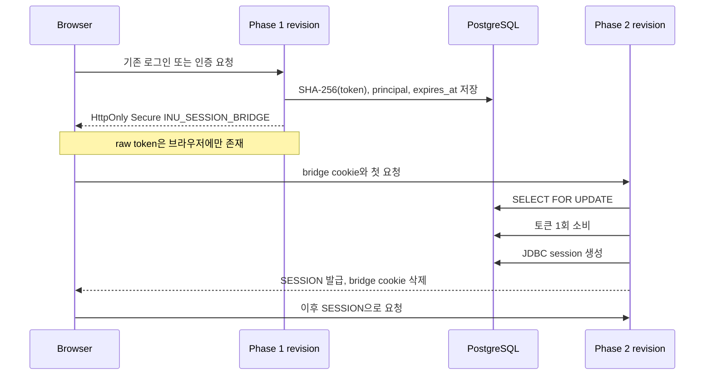

# Cloud Run 3인스턴스 확장과 2단계 세션 호환 브리지

## 요약

단일 Cloud Run 인스턴스의 메모리에 있던 로그인 상태와 동시성 제어를
PostgreSQL 공유 상태로 옮겼다. 기존 세션 저장소를 즉시 바꾸면 모든 사용자가
한 번에 로그아웃되므로, 1회용 opaque 토큰을 이용한 `issue -> consume` 두 단계
브리지를 추가했다.

동시에 3인스턴스에서 달라질 수 있던 관리자 작업 락, 로그인 실패 횟수,
Caffeine 캐시 무효화도 공유 상태로 전환했다. 배포는 후보 리비전을 0% 트래픽으로
검증한 후 전환하며, 세션 저장소가 호환되는 정상 상태부터 10% -> 50% -> 100%
카나리를 적용한다.

## 해결해야 했던 문제

| 영역 | 단일 인스턴스 구현 | 다중 인스턴스 위험 | 변경 |
|---|---|---|---|
| 사용자/관리자 세션 | 컨테이너 메모리 | 다른 인스턴스에서 로그인 소실 | Spring Session JDBC |
| 세션 전환 | 일괄 교체 | 전환 순간 전체 로그아웃 | 1회용 DB 토큰 브리지 |
| 관리자 중복 작업 | `ConcurrentHashMap` | 인스턴스별로 동시에 실행 | PostgreSQL advisory lock |
| 로그인 제한 | `ConcurrentHashMap` | 인스턴스를 바꾸면 횟수 초기화 | 해시 키 기반 DB 카운터 |
| Caffeine 무효화 | 로컬 이벤트 | 다른 인스턴스에 오래된 결과 잔류 | DB 버전 + 1초 폴링 |
| 배포 | 즉시 100% 트래픽 | 시작/마이그레이션 실패가 바로 노출 | 0% 후보 검증 + 롤백 |

## 세션 마이그레이션

### 1단계: issue

- 기존 컨테이너 세션을 유지한다.
- 로그인·회원가입·관리자 로그인 시 256비트 난수 토큰을 발급한다.
- 이미 로그인한 세션도 다음 요청에서 토큰을 받는다.
- 서버에는 raw token 대신 SHA-256 해시만 저장한다.
- 사용자 토큰에는 `user_id`, 관리자 토큰에는 관리자 식별자만 연결한다.
- 로그아웃, 회원탈퇴, 다른 계정 로그인 시 기존 토큰을 폐기한다.

### 2단계: consume

- Spring Session JDBC를 활성화한다.
- 공유 세션이 없고 브리지 쿠키가 있을 때만 토큰을 소비한다.
- `SELECT ... FOR UPDATE`와 삭제를 같은 트랜잭션에서 수행하므로 동시 요청 중
  하나만 성공한다.
- 활성 사용자 여부를 DB에서 다시 확인한 뒤 새 보안 컨텍스트를 만든다.
- 세션 principal에는 비밀번호 해시를 저장하지 않는다.
- 성공·만료·거부 결과와 관계없이 브리지 쿠키를 제거한다.

### 피할 수 없는 최초 경계

구현 전에 실행 중이던 구 리비전의 메모리 세션은 외부에서 읽거나 내보낼
인터페이스가 없다. 따라서 **브리지 1단계를 처음 배포하는 시점의 기존 세션은
한 번 갱신해야 한다.** 1단계 이후 생성되거나 활동한 세션부터는 2단계 전환과
후속 다중 인스턴스 배포에서 로그인 연속성을 유지한다.

이 한계 때문에 “현재 존재하는 메모리 상태까지 무손실 이전”이라고 표현하지
않는다. 포트폴리오의 무중단 범위는 다음과 같다.

- HTTP 요청 가용성: 후보 검증과 Cloud Run 리비전 전환으로 유지
- 로그인 연속성: 브리지 1단계 이후부터 유지
- 브리지 도입 전 메모리 세션: 최초 1회 갱신 필요

## 다중 인스턴스 정합성

### 관리자 작업 락

`pg_try_advisory_lock`을 실행한 DB 커넥션을 작업 종료까지 유지한다. 같은 작업
키는 모든 인스턴스에서 동일한 64비트 값으로 해시된다. 프로세스가 비정상
종료되더라도 커넥션이 닫히면 PostgreSQL이 락을 자동 해제한다.

### 로그인 제한

`namespace + username + client IP`를 SHA-256으로 해시한 키만 저장한다. 실패 횟수
증가는 원자적 `UPDATE`로 처리하고, 최초 동시 삽입 충돌은 unique key 이후
재시도로 합산한다. 사용자와 관리자는 namespace를 분리한다.

### Caffeine 캐시

데이터 변경 커밋 후 `shared_cache_versions`의 scope 버전을 증가시킨다. 각
인스턴스는 1초마다 버전을 확인하고 자신이 관찰한 값보다 크면 관련 로컬
캐시를 비운다. 읽기 성능은 로컬 Caffeine으로 유지하면서 최대 1초의 명시적인
최종 일관성 경계를 갖는다.

## 배포와 롤백

배포 파라미터는
[production-rollout.env](../../../.github/deploy/production-rollout.env)에 버전
관리한다.

1. 전체 테스트와 `bootJar` 빌드
2. 현재 100% 트래픽 리비전 기록
3. 새 리비전을 `--no-traffic`과 고유 tag로 배포
4. tag URL에서 health, 과목 수, CSRF, 관리자 로그인과 세션 검증
5. 브리지 단계는 새 리비전으로 100% 원자 전환
6. 정상 단계(`mode=off`, JDBC 유지)는 10% -> 50% -> 100% 카나리
7. 어느 검증에서든 실패하면 기록해 둔 리비전으로 100% 롤백

브리지 단계에서 구·신 리비전을 장시간 혼합하지 않는 이유는 메모리 세션과
JDBC 세션이 서로의 쿠키를 읽을 수 없기 때문이다. Cloud Run session affinity는
best effort이므로 정합성의 근거로 사용하지 않는다.

참고:

- [Cloud Run revision과 트래픽 전환](https://cloud.google.com/run/docs/rollouts-rollbacks-traffic-migration)
- [Cloud Run session affinity의 best-effort 제한](https://cloud.google.com/run/docs/configuring/session-affinity)
- [Spring Session JDBC](https://docs.spring.io/spring-session/reference/configuration/jdbc.html)

## 검증

### 자동 테스트

2026-07-27 로컬 전체 테스트:

- tests: 181
- passed: 179
- skipped: 2
- failures: 0

새로 추가한 핵심 시나리오:

- issue 단계의 opaque 쿠키 발급과 hash-only 저장
- user/admin 브리지 토큰의 JDBC 세션 전환
- JDBC 세션으로 다음 요청 유지
- 동일 브리지 토큰 재사용 거부
- 세션 직렬화 principal에 비밀번호 해시가 없음을 역직렬화해 확인
- 서로 다른 rate-limit store 인스턴스가 실패/해제 상태 공유
- 다른 Caffeine 인스턴스가 DB 버전 변경을 반영
- advisory lock 획득/해제가 같은 커넥션에서 수행됨을 확인

### 확장값의 근거

기존 [캐시·확장 벤치마크](../2026-07-25-cache-scaling/README.md)에서 1,000 VU 기준:

| 구성 | 요청 수 | p95 | 클라이언트 실패 | 서버 5xx |
|---|---:|---:|---:|---:|
| max=1, concurrency=80 | 94,434 | 1,991.06ms | 0 | 0 |
| max=3, concurrency=40, pool=10 | 172,792 | 793.54ms | 8 | 0 |

요청 처리량은 83.0% 증가했고 p95는 60.1% 감소했다. 따라서 2단계 최종값은
`max=3`, `concurrency=40`, 인스턴스당 DB pool `max=10/min=2`로 정했다.

## 운영 증거

| 단계 | 리비전 | 트래픽 | health | 세션 검증 | 시각 |
|---|---|---:|---|---|---|
| 1단계 issue | `inu-timetable-backend-00023-fam` | 100% | `UP` | 관리자 로그인/`me` 200, `INU_SESSION_BRIDGE` 발급 | 2026-07-27 14:48 KST |
| 2단계 consume | 배포 후 기록 | 100% | 배포 후 기록 | 기존 브리지 쿠키로 JDBC 세션 생성 | 배포 후 기록 |

1단계는 GitHub Actions run
[`30240575690`](https://github.com/coldmans/inu_timetable/actions/runs/30240575690)에서
후보 리비전을 0% 트래픽으로 검증한 뒤 원자 전환했다. 2단계 행은 실제 운영
전환 후 Cloud Run 리비전과 세션 연속성 결과로 갱신한다.
